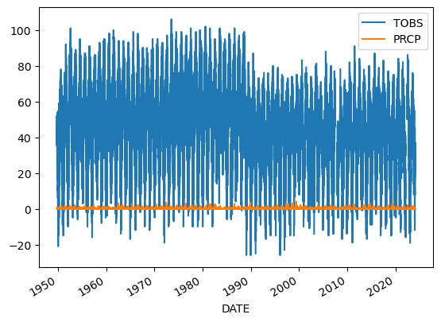
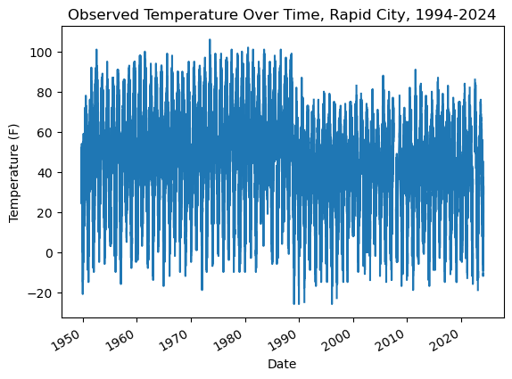
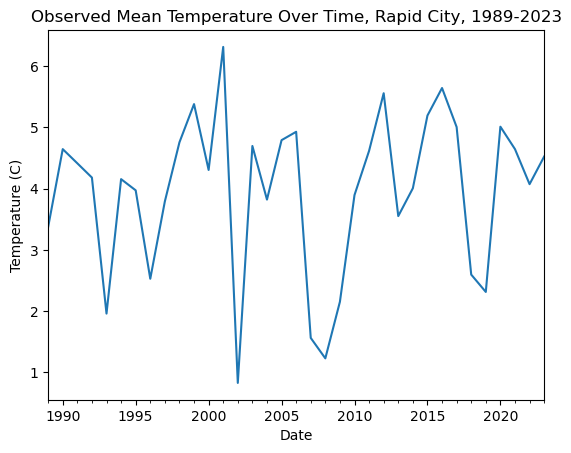
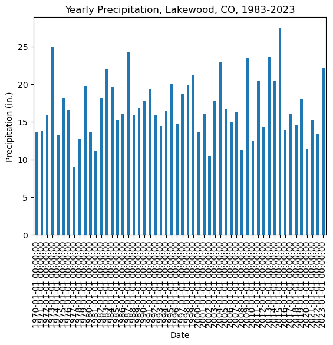
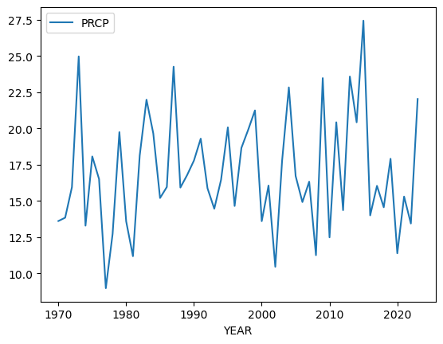
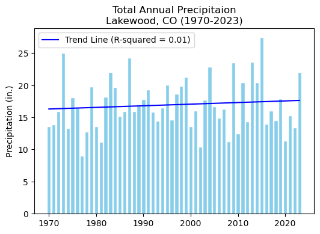

# Climate change is impacting the way people live around the world

::: {.cell .markdown}

Higher highs, lower lows, storms, and smoke – we’re all feeling the
effects of climate change. In this workflow, you will take a look at
trends in temperature over time in Rapid City, SD.

> **Important**
>
> [Read about some of the effects of – and solutions for – climate
> change on the Pine Ridge Reservation southeast of Rapid
> City.](https://www.theguardian.com/environment/2022/dec/03/south-dakota-reservation-food-desert-residents-transforming-crop-oasis)

## Get started with open reproducible science!

[Open reproducible
science](https://www.earthdatascience.org/courses/intro-to-earth-data-science/open-reproducible-science/get-started-open-reproducible-science/)
makes scientific methods, data and outcomes available to everyone. That
means that *everyone* who wants should be able to **find**, **read**,
**understand**, and **run** your workflows for themselves.


> Image from
> https://www.earthdata.nasa.gov/esds/open-science/oss-for-eso-workshops

Few if any science projects are 100% open and reproducible (yet!).
However, members of the open science community have developed open
source tools and practices that can help you move toward that goal. You
will learn about many of those tools in [the Intro to Earth Data Science
textbook](https://www.earthdatascience.org/courses/intro-to-earth-data-science/).
Don’t worry about learning all the tools at once – we’ve picked a few
for you to get started with.

------------------------------------------------------------------------

> **<i class="fa fa-solid fa-glasses fa-large" aria-label="glasses"></i>
> Further reading**
>
> Read [our textbook chapter about open reproducible
> science](https://www.earthdatascience.org/courses/intro-to-earth-data-science/open-reproducible-science/get-started-open-reproducible-science/).

> **<i class="fa fa-solid fa-pencil fa-large" aria-label="pencil"></i>
> What does open reproducible science mean to you?**
>
> <i class="far fa-regular fa-square" aria-label="square"></i> Create a
> new Markdown cell below this one using the `+ Markdown` button in the
> upper left.
>
> <i class="far fa-regular fa-square" aria-label="square"></i> In the
> new cell, answer the following questions using a **numbered list** in
> Markdown:
>
> 1.  In 1-2 sentences, define open reproducible science.
> 2.  In 1-2 sentences, choose one of the open source tools that you
>     have learned about (i.e. Shell, Git/GitHub, Jupyter Notebook,
>     Python) and explain how it supports open reproducible science.

1.
2.


## <i class="fa fa-solid fa-pencil fa-large" aria-label="pencil"></i> Human-readable and Machine-readable

<i class="far fa-regular fa-square" aria-label="square"></i> Create a
new Markdown cell below this one using the <kbd>ESC</kbd> + <kbd>b</kbd>
keyboard shortcut.

<i class="far fa-regular fa-square" aria-label="square"></i> In the new
cell, answer the following question in a Markdown **quote**: In 1-2
sentences, does this Jupyter Notebook file have a machine-readable name?
Explain your answer.

> Negatory. Spaces, upper case letters, Exlamation mark! The machine would be so confused!

------------------------------------------------------------------------

## What the fork?! Who wrote this?

Below is a scientific Python workflow. But something’s wrong – The code
won’t run! Your task is to follow the instructions below to **clean and
debug** the Python code below so that it runs.

> **Tip**
>
> Don’t worry if you can’t solve every bug right away. We’ll get there!
> The most important thing is to identify problems with the code and
> write high-quality [**GitHub
> Issues**](https://docs.github.com/en/issues/tracking-your-work-with-issues/creating-an-issue#creating-an-issue-from-a-repository).

At the end, you’ll **repeat the workflow** for a location and
measurement of your choosing.

Alright! Let’s clean up this code. First things first…

> **<i class="fa fa-solid fa-keyboard fa-large" aria-label="keyboard"></i>
> Machine-readable file names**
>
> Rename this notebook (if necessary) with an [**expressive and
> machine-readable file
> name**](https://www.earthdatascience.org/courses/intro-to-earth-data-science/open-reproducible-science/get-started-open-reproducible-science/best-practices-for-organizing-open-reproducible-science/)

------------------------------------------------------------------------

## Python **packages** let you use code written by experts around the world

Because Python is open source, lots of different people and
organizations can contribute (including you!). Many contributions are in
the form of **packages** which do not come with a standard Python
download.

> **<i class="fa fa-solid fa-glasses fa-large" aria-label="glasses"></i>
> Read more**
>
> [Packages need to be installed and
> **imported**](https://www.earthdatascience.org/courses/intro-to-earth-data-science/python-code-fundamentals/use-python-packages/).

In the cell below, someone was trying to import the **pandas package**,
which helps us to work with [**tabular data** such as comma-separated
value or csv
files](https://www.earthdatascience.org/courses/intro-to-earth-data-science/file-formats/use-text-files/).

> **<i class="fa fa-solid fa-keyboard fa-large" aria-label="keyboard"></i>
> Your task**
>
> 1.  Correct the typo below to properly import the pandas package under
>     its **alias** pd.
> 2.  Run the cell to import pandas
>
> NOTE: **Run your code in the right **environment\*\* to avoid import
> errors\*\*
>
> We’ve created a coding **environment** for you to use that already has
> all the software and libraries you will need! When you try to run some
> code, you may be prompted to select a **kernel**. The **kernel**
> refers to the version of Python you are using. You should use the
> **base** kernel, which should be the default option.


```python
# Import pandas
import pandas as pd
```

Once you have run the cell above and imported `pandas`, **run the cell
below**. It is a test cell that will tell you if you completed the task
successfully. If a test cell isn’t working the way you expect, check
that you ran your code **immediately before** running the test.


```python
# DO NOT MODIFY THIS TEST CELL
points = 0
try:
    pd.DataFrame()
    points += 5
    print('\u2705 Great work! You correctly imported the pandas library.')
except:
    print('\u274C Oops - pandas was not imported correctly.')
print('You earned {} of 5 points for importing pandas'.format(points))
```

    ✅ Great work! You correctly imported the pandas library.
    You earned 5 of 5 points for importing pandas


------------------------------------------------------------------------

## There are more Earth Observation data online than any one person could ever look at

[NASA’s Earth Observing System Data and Information System (EOSDIS)
alone manages over 9PB of
data](https://www.earthdata.nasa.gov/learn/articles/getting-petabytes-people-how-eosdis-facilitates-earth-observing-data-discovery-and-use).
1 PB is roughly 100 times the entire Library of Congress (a good
approximation of all the books available in the US). It’s all available
to **you** once you learn how to download what you want.

Here we’re using the NOAA National Centers for Environmental Information
(NCEI) [Access Data
Service](https://www.ncei.noaa.gov/support/access-data-service-api-user-documentation)
application progamming interface (API) to request data from their web
servers. We will be using data collected as part of the Global
Historical Climatology Network daily (GHCNd) from their [Climate Data
Online library](https://www.ncdc.noaa.gov/cdo-web/datasets) program at
NOAA.

For this example we’re requesting [daily summary data in Rapid City, CO
(station ID
USC00396947)](https://www.ncdc.noaa.gov/cdo-web/datasets/GHCND/stations/GHCND:USC00396947/detail).

> **<i class="fa fa-solid fa-pencil fa-large" aria-label="pencil"></i>
> Your task:**
>
> 1.  Research the [**Global Historical Climatology Network -
>     Daily**](https://www.ncei.noaa.gov/metadata/geoportal/rest/metadata/item/gov.noaa.ncdc:C00861/html)
>     data source.
> 2.  In the cell below, write a 2-3 sentence description of the data
>     source. You should describe:
>     -   who takes the data
>     -   where the data were taken
>     -   what the maximum temperature units are
>     -   how the data are collected
> 3.  Include a citation of the data (**HINT:** See the ‘Data Citation’
>     tab on the GHCNd overview page).

**YOUR DATA DESCRIPTION AND CITATION HERE** 
#The Global Historical Climatology Network - Daily (GHCN-Daily) dataset is data sourced from 30 different sources od daily data observations. Including 90,000 weather stations, 60,000 mostly collect percipitation data while the others collectct various meteroloogical data including daily maximum and minimum temperature, temperature at the time of observation, snowfall, snow depth, etc. Data regularly synced and maintained.
#This is the data being accessed by the ncei_weather_url

#Menne, Matthew J., Imke Durre, Bryant Korzeniewski, Shelley McNeill, Kristy Thomas, Xungang Yin, Steven Anthony, Ron Ray, Russell S. Vose, Byron E.Gleason, and Tamara G. Houston (2012): Global Historical Climatology Network - Daily (GHCN-Daily), Version 3. [indicate subset used]. NOAA National Climatic Data Center. doi:10.7289/V5D21VHZ [access date].

## You can access NCEI GHCNd Data from the internet using its API 🖥️ 📡 🖥️

The cell below contains the URL for the data you will use in this part
of the notebook. We created this URL by generating what is called an
**API endpoint** using the NCEI [API
documentation](https://www.ncei.noaa.gov/support/access-data-service-api-user-documentation).

> **Note**
>
> An **application programming interface** (API) is a way for two or
> more computer programs or components to communicate with each other.
> It is a type of software interface, offering a service to other pieces
> of software ([Wikipedia](https://en.wikipedia.org/wiki/API)).

However, we still have a problem - we can’t get the URL back later on
because it isn’t saved in a **variable**. In other words, we need to
give the url a name so that we can request in from Python later (sadly,
Python has no ‘hey what was that thingy I typed yesterday?’ function).

> **<i class="fa fa-solid fa-glasses fa-large" aria-label="glasses"></i>
> Read more**
>
> Check out the [textbook section on
> variables](https://www.earthdatascience.org/courses/intro-to-earth-data-science/python-code-fundamentals/get-started-using-python/variables/)

> **<i class="fa fa-solid fa-keyboard fa-large" aria-label="keyboard"></i>
> Your task**
>
> 1.  Pick an expressive variable name for the URL. HINT: click on the
>     `Variables` button up top to see all your variables. Your new url
>     variable will not be there until you define it and run the code
> 2.  Reformat the URL so that it adheres to the [79-character PEP-8
>     line
>     limit](https://peps.python.org/pep-0008/#maximum-line-length).You
>     should see two vertical lines in each cell - don’t let your code
>     go past the second line
> 3.  At the end of the cell where you define your url variable, **call
>     your variable (type out its name)** so it can be tested.


```python
ncei_weather_url = (
    'https://www.ncei.noaa.gov/access/services/data/v1'
    '?dataset=daily-summaries'
    '&dataTypes=TOBS,PRCP'
    '&stations=USC00396947'
    '&startDate=1949-10-01'
    '&endDate=2024-02-18'
    '&includeStationName=true'
    '&includeStationLocation=1'
    '&units=standard')
ncei_weather_url
```


    'https://www.ncei.noaa.gov/access/services/data/v1?dataset=daily-summaries&dataTypes=TOBS,PRCP&stations=USC00396947&startDate=1949-10-01&endDate=2024-02-18&includeStationName=true&includeStationLocation=1&units=standard'


```python
# DO NOT MODIFY THIS TEST CELL
resp_url = _
points = 0

if type(resp_url)==str:
    points += 3
    print('\u2705 Great work! You correctly called your url variable.')
else:
    print('\u274C Oops - your url variable was not called correctly.')

if len(resp_url)==218:
    points += 3
    print('\u2705 Great work! Your url is the correct length.')
else:
    print('\u274C Oops - your url variable is not the correct length.')

print('You earned {} of 6 points for defining a url variable'.format(points))
```

    ✅ Great work! You correctly called your url variable.
    ✅ Great work! Your url is the correct length.
    You earned 6 of 6 points for defining a url variable


------------------------------------------------------------------------

## **Download and get started working with NCEI data**

The `pandas` library you imported can download data from the internet
directly into a type of Python **object** called a `DataFrame`. In the
code cell below, you can see an attempt to do just this. But there are
some problems…

> **<i class="fa fa-solid fa-keyboard fa-large" aria-label="keyboard"></i>
> You’re ready to fix some code!**
>
> Your task is to:
>
> 1.  Leave a space between the `#` and text in the comment and try
>     making the comment more informative
>
> 2.  Make any changes needed to get this code to run. HINT: The
>     `my_url` variable doesn’t exist - you need to replace it with the
>     variable name **you** chose.
>
> 3.  Modify the `.read_csv()` statement to include the following
>     parameters:
>
>     -   `index_col='DATE'` – this sets the `DATE` column as the index.
>         Needed for subsetting and resampling later on
>     -   `parse_dates=True` – this lets `python` know that you are
>         working with time-series data, and values in the indexed
>         column are **date time objects**
>     -   `na_values=['NaN']` – this lets `python` know how to handle
>         missing values
>
> 4.  Clean up the code by using **expressive variable names**,
>     **expressive column names**, **PEP-8 compliant code**, and
>     **descriptive comments**

**Make sure to call your `DataFrame` by typing it’s name as the last
line of your code cell** Then, you will be able to run the test cell
below and find out if your answer is correct.


```python
rapid_df = pd.read_csv(
    ncei_weather_url, 
    index_col="DATE", 
    parse_dates=True, 
    na_values=["NaN"]
)
rapid_df
```


<div>
<style scoped>
    .dataframe tbody tr th:only-of-type {
        vertical-align: middle;
    }

    .dataframe tbody tr th {
        vertical-align: top;
    }

    .dataframe thead th {
        text-align: right;
    }
</style>
<table border="1" class="dataframe">
  <thead>
    <tr style="text-align: right;">
      <th></th>
      <th>STATION</th>
      <th>NAME</th>
      <th>LATITUDE</th>
      <th>LONGITUDE</th>
      <th>ELEVATION</th>
      <th>PRCP</th>
      <th>TOBS</th>
    </tr>
    <tr>
      <th>DATE</th>
      <th></th>
      <th></th>
      <th></th>
      <th></th>
      <th></th>
      <th></th>
      <th></th>
    </tr>
  </thead>
  <tbody>
    <tr>
      <th>1949-10-01</th>
      <td>USC00396947</td>
      <td>RAPID CITY 4 NW, SD US</td>
      <td>44.12055</td>
      <td>-103.28417</td>
      <td>1060.4</td>
      <td>0.00</td>
      <td>51.0</td>
    </tr>
    <tr>
      <th>1949-10-02</th>
      <td>USC00396947</td>
      <td>RAPID CITY 4 NW, SD US</td>
      <td>44.12055</td>
      <td>-103.28417</td>
      <td>1060.4</td>
      <td>0.00</td>
      <td>51.0</td>
    </tr>
    <tr>
      <th>1949-10-03</th>
      <td>USC00396947</td>
      <td>RAPID CITY 4 NW, SD US</td>
      <td>44.12055</td>
      <td>-103.28417</td>
      <td>1060.4</td>
      <td>0.00</td>
      <td>52.0</td>
    </tr>
    <tr>
      <th>1949-10-04</th>
      <td>USC00396947</td>
      <td>RAPID CITY 4 NW, SD US</td>
      <td>44.12055</td>
      <td>-103.28417</td>
      <td>1060.4</td>
      <td>0.00</td>
      <td>45.0</td>
    </tr>
    <tr>
      <th>1949-10-05</th>
      <td>USC00396947</td>
      <td>RAPID CITY 4 NW, SD US</td>
      <td>44.12055</td>
      <td>-103.28417</td>
      <td>1060.4</td>
      <td>0.00</td>
      <td>50.0</td>
    </tr>
    <tr>
      <th>...</th>
      <td>...</td>
      <td>...</td>
      <td>...</td>
      <td>...</td>
      <td>...</td>
      <td>...</td>
      <td>...</td>
    </tr>
    <tr>
      <th>2024-02-14</th>
      <td>USC00396947</td>
      <td>RAPID CITY 4 NW, SD US</td>
      <td>44.12055</td>
      <td>-103.28417</td>
      <td>1060.4</td>
      <td>0.15</td>
      <td>24.0</td>
    </tr>
    <tr>
      <th>2024-02-15</th>
      <td>USC00396947</td>
      <td>RAPID CITY 4 NW, SD US</td>
      <td>44.12055</td>
      <td>-103.28417</td>
      <td>1060.4</td>
      <td>0.03</td>
      <td>21.0</td>
    </tr>
    <tr>
      <th>2024-02-16</th>
      <td>USC00396947</td>
      <td>RAPID CITY 4 NW, SD US</td>
      <td>44.12055</td>
      <td>-103.28417</td>
      <td>1060.4</td>
      <td>0.20</td>
      <td>8.0</td>
    </tr>
    <tr>
      <th>2024-02-17</th>
      <td>USC00396947</td>
      <td>RAPID CITY 4 NW, SD US</td>
      <td>44.12055</td>
      <td>-103.28417</td>
      <td>1060.4</td>
      <td>0.00</td>
      <td>NaN</td>
    </tr>
    <tr>
      <th>2024-02-18</th>
      <td>USC00396947</td>
      <td>RAPID CITY 4 NW, SD US</td>
      <td>44.12055</td>
      <td>-103.28417</td>
      <td>1060.4</td>
      <td>0.00</td>
      <td>NaN</td>
    </tr>
  </tbody>
</table>
<p>26042 rows × 7 columns</p>
</div>


```python
# DO NOT MODIFY THIS TEST CELL
tmax_df_resp = _
points = 0

if isinstance(tmax_df_resp, pd.DataFrame):
    points += 1
    print('\u2705 Great work! You called a DataFrame.')
else:
    print('\u274C Oops - make sure to call your DataFrame for testing.')

print('You earned {} of 2 points for downloading data'.format(points))
```

    ✅ Great work! You called a DataFrame.
    You earned 1 of 2 points for downloading data


> HINT: Check out the `type()` function below - you can use it to check
> that your data is now in `DataFrame` type object


```python
# Check that the data was imported into a pandas DataFrame
type(rapid_df)
```


    pandas.core.frame.DataFrame


```python

```

> **<i class="fa fa-solid fa-keyboard fa-large" aria-label="keyboard"></i>
> Clean up your DataFrame**
>
> Use double brackets to only select the columns you want in your
> DataFrame

**Make sure to call your `DataFrame` by typing it’s name as the last
line of your code cell** Then, you will be able to run the test cell
below and find out if your answer is correct.


```python

```


```python
rapid_df = rapid_df[['TOBS', 'PRCP']]
rapid_df
```


<div>
<style scoped>
    .dataframe tbody tr th:only-of-type {
        vertical-align: middle;
    }

    .dataframe tbody tr th {
        vertical-align: top;
    }

    .dataframe thead th {
        text-align: right;
    }
</style>
<table border="1" class="dataframe">
  <thead>
    <tr style="text-align: right;">
      <th></th>
      <th>TOBS</th>
      <th>PRCP</th>
    </tr>
    <tr>
      <th>DATE</th>
      <th></th>
      <th></th>
    </tr>
  </thead>
  <tbody>
    <tr>
      <th>1949-10-01</th>
      <td>51.0</td>
      <td>0.00</td>
    </tr>
    <tr>
      <th>1949-10-02</th>
      <td>51.0</td>
      <td>0.00</td>
    </tr>
    <tr>
      <th>1949-10-03</th>
      <td>52.0</td>
      <td>0.00</td>
    </tr>
    <tr>
      <th>1949-10-04</th>
      <td>45.0</td>
      <td>0.00</td>
    </tr>
    <tr>
      <th>1949-10-05</th>
      <td>50.0</td>
      <td>0.00</td>
    </tr>
    <tr>
      <th>...</th>
      <td>...</td>
      <td>...</td>
    </tr>
    <tr>
      <th>2024-02-14</th>
      <td>24.0</td>
      <td>0.15</td>
    </tr>
    <tr>
      <th>2024-02-15</th>
      <td>21.0</td>
      <td>0.03</td>
    </tr>
    <tr>
      <th>2024-02-16</th>
      <td>8.0</td>
      <td>0.20</td>
    </tr>
    <tr>
      <th>2024-02-17</th>
      <td>NaN</td>
      <td>0.00</td>
    </tr>
    <tr>
      <th>2024-02-18</th>
      <td>NaN</td>
      <td>0.00</td>
    </tr>
  </tbody>
</table>
<p>26042 rows × 2 columns</p>
</div>


```python
# DO NOT MODIFY THIS TEST CELL
tmax_df_resp = _
points = 0

summary = [round(val, 2) for val in tmax_df_resp.mean().values]
if summary == [0.05, 54.53]:
    points += 4
    print('\u2705 Great work! You correctly downloaded data.')
else:
    print('\u274C Oops - your data are not correct.')
print('You earned {} of 5 points for downloading data'.format(points))
```

    ❌ Oops - your data are not correct.
    You earned 0 of 5 points for downloading data


------------------------------------------------------------------------

## Plot the precpitation column (PRCP) vs time to explore the data

Plotting in Python is easy, but not quite this easy:


```python
rapid_df.plot()
```


    <Axes: xlabel='DATE'>


    

    


> ****Label and describe your plots****
>
> <figure>
>  alt="Source: https://xkcd.com/833" />
> <figcaption aria-hidden="true">Source: https://xkcd.com/833</figcaption>
> </figure>
>
> Make sure each plot has:
>
> -   A title that explains where and when the data are from
> -   x- and y- axis labels with **units** where appropriate
> -   A legend where appropriate

You’ll always need to add some instructions on labels and how you want
your plot to look.

> **<i class="fa fa-solid fa-keyboard fa-large" aria-label="keyboard"></i>
> Your task:**
>
> 1.  Change `dataframe` to **your** `DataFrame` name.
> 2.  Change `y=` to the name of your **observed temperature** column
>     name.
> 3.  Use the `title`, `ylabel`, and `xlabel` parameters to add key text
>     to your plot.
> 4.  Adjust the size of your figure using `figsize=(x,y)` where `x` is
>     figure width and `y` is figure height
>
> > **HINT:** labels have to be a *type* in Python called a **string**.
> > You can make a string by putting quotes around your label, just like
> > the column names in the sample code (eg `y='TOBS'`).


```python
 #Convert to celcius
rapid_df['TCel'] = ((rapid_df['TOBS'] - 32) * (5 / 9))
rapid_df

```

    /tmp/ipykernel_2524/1770224429.py:2: SettingWithCopyWarning: 
    A value is trying to be set on a copy of a slice from a DataFrame.
    Try using .loc[row_indexer,col_indexer] = value instead
    
    See the caveats in the documentation: https://pandas.pydata.org/pandas-docs/stable/user_guide/indexing.html#returning-a-view-versus-a-copy
      rapid_df['TCel'] = ((rapid_df['TOBS'] - 32) * (5 / 9))


<div>
<style scoped>
    .dataframe tbody tr th:only-of-type {
        vertical-align: middle;
    }

    .dataframe tbody tr th {
        vertical-align: top;
    }

    .dataframe thead th {
        text-align: right;
    }
</style>
<table border="1" class="dataframe">
  <thead>
    <tr style="text-align: right;">
      <th></th>
      <th>TOBS</th>
      <th>PRCP</th>
      <th>TCel</th>
    </tr>
    <tr>
      <th>DATE</th>
      <th></th>
      <th></th>
      <th></th>
    </tr>
  </thead>
  <tbody>
    <tr>
      <th>1949-10-01</th>
      <td>51.0</td>
      <td>0.00</td>
      <td>10.555556</td>
    </tr>
    <tr>
      <th>1949-10-02</th>
      <td>51.0</td>
      <td>0.00</td>
      <td>10.555556</td>
    </tr>
    <tr>
      <th>1949-10-03</th>
      <td>52.0</td>
      <td>0.00</td>
      <td>11.111111</td>
    </tr>
    <tr>
      <th>1949-10-04</th>
      <td>45.0</td>
      <td>0.00</td>
      <td>7.222222</td>
    </tr>
    <tr>
      <th>1949-10-05</th>
      <td>50.0</td>
      <td>0.00</td>
      <td>10.000000</td>
    </tr>
    <tr>
      <th>...</th>
      <td>...</td>
      <td>...</td>
      <td>...</td>
    </tr>
    <tr>
      <th>2024-02-14</th>
      <td>24.0</td>
      <td>0.15</td>
      <td>-4.444444</td>
    </tr>
    <tr>
      <th>2024-02-15</th>
      <td>21.0</td>
      <td>0.03</td>
      <td>-6.111111</td>
    </tr>
    <tr>
      <th>2024-02-16</th>
      <td>8.0</td>
      <td>0.20</td>
      <td>-13.333333</td>
    </tr>
    <tr>
      <th>2024-02-17</th>
      <td>NaN</td>
      <td>0.00</td>
      <td>NaN</td>
    </tr>
    <tr>
      <th>2024-02-18</th>
      <td>NaN</td>
      <td>0.00</td>
      <td>NaN</td>
    </tr>
  </tbody>
</table>
<p>26042 rows × 3 columns</p>
</div>


```python
# Plot the data using .plot

rapid_df.plot(
    y='TOBS',
    title='Observed Temperature Over Time, Rapid City, 1994-2024',
    xlabel='Date',
    legend= False,
    ylabel='Temperature (F)')
```


    <Axes: title={'center': 'Observed Temperature Over Time, Rapid City, 1994-2024'}, xlabel='Date', ylabel='Temperature (F)'>


    

    


> **<i class="fa fa-solid fa-pepper-hot fa-large" aria-label="pepper-hot"></i>
> Want an EXTRA CHALLENGE?**
>
> There are many other things you can do to customize your plot. Take a
> look at the [pandas plotting
> galleries](https://pandas.pydata.org/docs/user_guide/visualization.html)
> and the [documentation of
> plot](https://pandas.pydata.org/docs/reference/api/pandas.DataFrame.plot.html)
> to see if there’s other changes you want to make to your plot. Some
> possibilities include:
>
> -   Remove the legend since there’s only one data series
> -   Increase the figure size
> -   Increase the font size
> -   Change the colors
> -   Use a bar graph instead (usually we use lines for time series, but
>     since this is annual it could go either way)
> -   Add a trend line
>
> Not sure how to do any of these? Try searching the internet, or asking
> an AI!

------------------------------------------------------------------------

> **<i class="fa fa-solid fa-pepper-hot fa-large" aria-label="pepper-hot"></i>
> Convert units**
>
> Modify the code below to **add a column that includes temperature in
> Celsius**. The code below was written by your colleague. Can you fix
> this so that it correctly calculates temperature in Celsius and adds a
> new column?


```python
# Convert to celcius
rapid_df['TCel'] = ((rapid_df['TOBS'] - 32) * (5 / 9))
rapid_df

```

    /tmp/ipykernel_2524/869984472.py:2: SettingWithCopyWarning: 
    A value is trying to be set on a copy of a slice from a DataFrame.
    Try using .loc[row_indexer,col_indexer] = value instead
    
    See the caveats in the documentation: https://pandas.pydata.org/pandas-docs/stable/user_guide/indexing.html#returning-a-view-versus-a-copy
      rapid_df['TCel'] = ((rapid_df['TOBS'] - 32) * (5 / 9))


<div>
<style scoped>
    .dataframe tbody tr th:only-of-type {
        vertical-align: middle;
    }

    .dataframe tbody tr th {
        vertical-align: top;
    }

    .dataframe thead th {
        text-align: right;
    }
</style>
<table border="1" class="dataframe">
  <thead>
    <tr style="text-align: right;">
      <th></th>
      <th>TOBS</th>
      <th>PRCP</th>
      <th>TCel</th>
    </tr>
    <tr>
      <th>DATE</th>
      <th></th>
      <th></th>
      <th></th>
    </tr>
  </thead>
  <tbody>
    <tr>
      <th>1949-10-01</th>
      <td>51.0</td>
      <td>0.00</td>
      <td>10.555556</td>
    </tr>
    <tr>
      <th>1949-10-02</th>
      <td>51.0</td>
      <td>0.00</td>
      <td>10.555556</td>
    </tr>
    <tr>
      <th>1949-10-03</th>
      <td>52.0</td>
      <td>0.00</td>
      <td>11.111111</td>
    </tr>
    <tr>
      <th>1949-10-04</th>
      <td>45.0</td>
      <td>0.00</td>
      <td>7.222222</td>
    </tr>
    <tr>
      <th>1949-10-05</th>
      <td>50.0</td>
      <td>0.00</td>
      <td>10.000000</td>
    </tr>
    <tr>
      <th>...</th>
      <td>...</td>
      <td>...</td>
      <td>...</td>
    </tr>
    <tr>
      <th>2024-02-14</th>
      <td>24.0</td>
      <td>0.15</td>
      <td>-4.444444</td>
    </tr>
    <tr>
      <th>2024-02-15</th>
      <td>21.0</td>
      <td>0.03</td>
      <td>-6.111111</td>
    </tr>
    <tr>
      <th>2024-02-16</th>
      <td>8.0</td>
      <td>0.20</td>
      <td>-13.333333</td>
    </tr>
    <tr>
      <th>2024-02-17</th>
      <td>NaN</td>
      <td>0.00</td>
      <td>NaN</td>
    </tr>
    <tr>
      <th>2024-02-18</th>
      <td>NaN</td>
      <td>0.00</td>
      <td>NaN</td>
    </tr>
  </tbody>
</table>
<p>26042 rows × 3 columns</p>
</div>


```python
# DO NOT MODIFY THIS TEST CELL
tmax_df_resp = _
points = 0

if isinstance(tmax_df_resp, pd.DataFrame):
    points += 1
    print('\u2705 Great work! You called a DataFrame.')
else:
    print('\u274C Oops - make sure to call your DataFrame for testing.')

summary = [round(val, 2) for val in tmax_df_resp.mean().values]
if summary == [0.05, 54.53, 12.52]:
    points += 4
    print('\u2705 Great work! You correctly converted to Celcius.')
else:
    print('\u274C Oops - your data are not correct.')
print('You earned {} of 5 points for converting to Celcius'.format(points))
```

    ✅ Great work! You called a DataFrame.
    ❌ Oops - your data are not correct.
    You earned 1 of 5 points for converting to Celcius


> **<i class="fa fa-solid fa-pepper-hot fa-large" aria-label="pepper-hot"></i>
> Want an EXTRA CHALLENGE?**
>
> 1.  As you did above, rewrite the code to be more expressive
> 2.  Using the code below as a framework, write and apply a
>     **function** that converts to Celcius. \> **Functions** let you
>     reuse code you have already written
> 3.  You should also rewrite this function and parameter names to be
>     more expressive.


```python
def a_function(a_parameter):
    """Convert temperature to Celcius"""
    return a_parameter # Put your equation in here

dataframe['celcius_column'] = dataframe['fahrenheit_column'].apply(convert)
```


    ---------------------------------------------------------------------------

    NameError                                 Traceback (most recent call last)

    Cell In[16], line 5
          2     """Convert temperature to Celcius"""
          3     return a_parameter # Put your equation in here
    ----> 5 dataframe['celcius_column'] = dataframe['fahrenheit_column'].apply(convert)


    NameError: name 'dataframe' is not defined


```python

```

## Subsetting and Resampling

Often when working with time-series data you may want to focus on a
shorter window of time, or look at weekly, monthly, or annual summaries
to help make the analysis more manageable.

> **<i class="fa fa-solid fa-glasses fa-large" aria-label="glasses"></i>
> Read more**
>
> Read more about
> [subsetting](https://www.earthdatascience.org/courses/use-data-open-source-python/use-time-series-data-in-python/date-time-types-in-pandas-python/subset-time-series-data-python/)
> and
> [resampling](https://www.earthdatascience.org/courses/use-data-open-source-python/use-time-series-data-in-python/date-time-types-in-pandas-python/resample-time-series-data-pandas-python/)
> time-series data in our Learning Portal.

For this demonstration, we will look at the last 40 years worth of data
and resample to explore a summary from each year that data were
recorded.

> **<i class="fa fa-solid fa-keyboard fa-large" aria-label="keyboard"></i>
> Your task**
>
> 1.  Replace `start-year` and `end-year` with 1983 and 2023
> 2.  Replace `dataframe` with the name of **your** data
> 3.  Replace `new_dataframe` with something more expressive
> 4.  Call your new variable
> 5.  Run the cell


```python
# Subset the data
weather1989to2023 = rapid_df.loc['1989':'2023']
weather1989to2023
```


<div>
<style scoped>
    .dataframe tbody tr th:only-of-type {
        vertical-align: middle;
    }

    .dataframe tbody tr th {
        vertical-align: top;
    }

    .dataframe thead th {
        text-align: right;
    }
</style>
<table border="1" class="dataframe">
  <thead>
    <tr style="text-align: right;">
      <th></th>
      <th>TOBS</th>
      <th>PRCP</th>
      <th>TCel</th>
    </tr>
    <tr>
      <th>DATE</th>
      <th></th>
      <th></th>
      <th></th>
    </tr>
  </thead>
  <tbody>
    <tr>
      <th>1989-01-01</th>
      <td>7.0</td>
      <td>0.00</td>
      <td>-13.888889</td>
    </tr>
    <tr>
      <th>1989-01-02</th>
      <td>25.0</td>
      <td>0.00</td>
      <td>-3.888889</td>
    </tr>
    <tr>
      <th>1989-01-03</th>
      <td>19.0</td>
      <td>0.00</td>
      <td>-7.222222</td>
    </tr>
    <tr>
      <th>1989-01-04</th>
      <td>47.0</td>
      <td>0.00</td>
      <td>8.333333</td>
    </tr>
    <tr>
      <th>1989-01-05</th>
      <td>27.0</td>
      <td>0.00</td>
      <td>-2.777778</td>
    </tr>
    <tr>
      <th>...</th>
      <td>...</td>
      <td>...</td>
      <td>...</td>
    </tr>
    <tr>
      <th>2023-12-27</th>
      <td>32.0</td>
      <td>0.31</td>
      <td>0.000000</td>
    </tr>
    <tr>
      <th>2023-12-28</th>
      <td>17.0</td>
      <td>0.00</td>
      <td>-8.333333</td>
    </tr>
    <tr>
      <th>2023-12-29</th>
      <td>28.0</td>
      <td>0.00</td>
      <td>-2.222222</td>
    </tr>
    <tr>
      <th>2023-12-30</th>
      <td>NaN</td>
      <td>0.00</td>
      <td>NaN</td>
    </tr>
    <tr>
      <th>2023-12-31</th>
      <td>NaN</td>
      <td>0.00</td>
      <td>NaN</td>
    </tr>
  </tbody>
</table>
<p>12054 rows × 3 columns</p>
</div>


```python
# DO NOT MODIFY THIS TEST CELL
df_resp = _
points = 0

if isinstance(df_resp, pd.DataFrame):
    points += 1
    print('\u2705 Great work! You called a DataFrame.')
else:
    print('\u274C Oops - make sure to call your DataFrame for testing.')

summary = [round(val, 2) for val in df_resp.mean().values]
if summary == [0.06, 55.67, 13.15]:
    points += 5
    print('\u2705 Great work! You correctly converted to Celcius.')
else:
    print('\u274C Oops - your data are not correct.')
print('You earned {} of 5 points for subsetting'.format(points))
```

    ✅ Great work! You called a DataFrame.
    ❌ Oops - your data are not correct.
    You earned 1 of 5 points for subsetting


## Now we are ready to calculate annual statistics

Here you will **resample** the 1983-2023 data to look the annual mean
values.

> **<i class="fa fa-solid fa-keyboard fa-large" aria-label="keyboard"></i>
> Resample your data**
>
> 1.  Replace `new_dataframe` with the variable you created in the cell
>     above where you subset the data
> 2.  Replace `'TIME'` with a `'W'`, `'M'`, or `'Y'` depending on
>     whether you’re doing a weekly, monthly, or yearly summary
> 3.  Replace `STAT` with a `sum`, `min`, `max`, or `mean` cal depending on
>     what kind of statistic you’re interested inculating.
> 4.  Replace `resampled_data` with a more expressive variable name
> 5.  Call your new variable
> 6.  Run the cell


```python
# Resample the data to look at yearly mean values
minwet89to23 = weather1989to2023.resample('YS').mean()
minwet89to23
```


<div>
<style scoped>
    .dataframe tbody tr th:only-of-type {
        vertical-align: middle;
    }

    .dataframe tbody tr th {
        vertical-align: top;
    }

    .dataframe thead th {
        text-align: right;
    }
</style>
<table border="1" class="dataframe">
  <thead>
    <tr style="text-align: right;">
      <th></th>
      <th>TOBS</th>
      <th>PRCP</th>
      <th>TCel</th>
    </tr>
    <tr>
      <th>DATE</th>
      <th></th>
      <th></th>
      <th></th>
    </tr>
  </thead>
  <tbody>
    <tr>
      <th>1989-01-01</th>
      <td>38.072829</td>
      <td>0.056359</td>
      <td>3.373794</td>
    </tr>
    <tr>
      <th>1990-01-01</th>
      <td>40.363112</td>
      <td>0.039068</td>
      <td>4.646174</td>
    </tr>
    <tr>
      <th>1991-01-01</th>
      <td>39.945869</td>
      <td>0.056875</td>
      <td>4.414372</td>
    </tr>
    <tr>
      <th>1992-01-01</th>
      <td>39.525862</td>
      <td>0.036714</td>
      <td>4.181034</td>
    </tr>
    <tr>
      <th>1993-01-01</th>
      <td>35.522581</td>
      <td>0.055881</td>
      <td>1.956989</td>
    </tr>
    <tr>
      <th>1994-01-01</th>
      <td>39.479769</td>
      <td>0.034540</td>
      <td>4.155427</td>
    </tr>
    <tr>
      <th>1995-01-01</th>
      <td>39.150568</td>
      <td>0.063609</td>
      <td>3.972538</td>
    </tr>
    <tr>
      <th>1996-01-01</th>
      <td>36.547486</td>
      <td>0.058785</td>
      <td>2.526381</td>
    </tr>
    <tr>
      <th>1997-01-01</th>
      <td>38.825073</td>
      <td>0.057634</td>
      <td>3.791707</td>
    </tr>
    <tr>
      <th>1998-01-01</th>
      <td>40.563739</td>
      <td>0.068343</td>
      <td>4.757633</td>
    </tr>
    <tr>
      <th>1999-01-01</th>
      <td>41.688202</td>
      <td>0.073104</td>
      <td>5.382335</td>
    </tr>
    <tr>
      <th>2000-01-01</th>
      <td>39.750751</td>
      <td>0.050771</td>
      <td>4.305973</td>
    </tr>
    <tr>
      <th>2001-01-01</th>
      <td>43.371134</td>
      <td>0.049639</td>
      <td>6.317297</td>
    </tr>
    <tr>
      <th>2002-01-01</th>
      <td>33.482143</td>
      <td>0.036126</td>
      <td>0.823413</td>
    </tr>
    <tr>
      <th>2003-01-01</th>
      <td>40.455253</td>
      <td>0.039186</td>
      <td>4.697363</td>
    </tr>
    <tr>
      <th>2004-01-01</th>
      <td>38.877828</td>
      <td>0.030242</td>
      <td>3.821016</td>
    </tr>
    <tr>
      <th>2005-01-01</th>
      <td>40.627119</td>
      <td>0.044620</td>
      <td>4.792844</td>
    </tr>
    <tr>
      <th>2006-01-01</th>
      <td>40.873278</td>
      <td>0.042870</td>
      <td>4.929599</td>
    </tr>
    <tr>
      <th>2007-01-01</th>
      <td>34.806931</td>
      <td>0.038515</td>
      <td>1.559406</td>
    </tr>
    <tr>
      <th>2008-01-01</th>
      <td>34.204969</td>
      <td>0.025892</td>
      <td>1.224983</td>
    </tr>
    <tr>
      <th>2009-01-01</th>
      <td>35.871324</td>
      <td>0.053828</td>
      <td>2.150735</td>
    </tr>
    <tr>
      <th>2010-01-01</th>
      <td>39.012384</td>
      <td>0.056767</td>
      <td>3.895769</td>
    </tr>
    <tr>
      <th>2011-01-01</th>
      <td>40.313846</td>
      <td>0.060282</td>
      <td>4.618803</td>
    </tr>
    <tr>
      <th>2012-01-01</th>
      <td>42.008746</td>
      <td>0.019341</td>
      <td>5.560415</td>
    </tr>
    <tr>
      <th>2013-01-01</th>
      <td>38.392638</td>
      <td>0.060685</td>
      <td>3.551466</td>
    </tr>
    <tr>
      <th>2014-01-01</th>
      <td>39.211310</td>
      <td>0.057726</td>
      <td>4.006283</td>
    </tr>
    <tr>
      <th>2015-01-01</th>
      <td>41.351275</td>
      <td>0.057260</td>
      <td>5.195153</td>
    </tr>
    <tr>
      <th>2016-01-01</th>
      <td>42.161644</td>
      <td>0.039508</td>
      <td>5.645358</td>
    </tr>
    <tr>
      <th>2017-01-01</th>
      <td>41.013889</td>
      <td>0.034082</td>
      <td>5.007716</td>
    </tr>
    <tr>
      <th>2018-01-01</th>
      <td>36.670732</td>
      <td>0.057335</td>
      <td>2.594851</td>
    </tr>
    <tr>
      <th>2019-01-01</th>
      <td>36.159544</td>
      <td>0.085056</td>
      <td>2.310858</td>
    </tr>
    <tr>
      <th>2020-01-01</th>
      <td>41.023438</td>
      <td>0.044006</td>
      <td>5.013021</td>
    </tr>
    <tr>
      <th>2021-01-01</th>
      <td>40.363248</td>
      <td>0.032225</td>
      <td>4.646249</td>
    </tr>
    <tr>
      <th>2022-01-01</th>
      <td>39.331395</td>
      <td>0.028421</td>
      <td>4.072997</td>
    </tr>
    <tr>
      <th>2023-01-01</th>
      <td>40.144578</td>
      <td>0.046313</td>
      <td>4.524766</td>
    </tr>
  </tbody>
</table>
</div>


```python
# DO NOT MODIFY THIS TEST CELL
df_resp = _
points = 0

if isinstance(df_resp, pd.DataFrame):
    points += 1
    print('\u2705 Great work! You called a DataFrame.')
else:
    print('\u274C Oops - make sure to call your DataFrame for testing.')

summary = [round(val, 2) for val in df_resp.mean().values]
if summary == [0.06, 55.37, 12.99]:
    points += 5
    print('\u2705 Great work! You correctly converted to Celcius.')
else:
    print('\u274C Oops - your data are not correct.')
print('You earned {} of 5 points for resampling'.format(points))
```

    ✅ Great work! You called a DataFrame.
    ❌ Oops - your data are not correct.
    You earned 1 of 5 points for resampling


> **<i class="fa fa-solid fa-keyboard fa-large" aria-label="keyboard"></i>
> Plot your resampled data**


```python
# Plot mean annual temperature 
minwet89to23.plot(
    y='TCel',
    title='Observed Mean Temperature Over Time, Rapid City, 1989-2023',
    xlabel='Date',
    ylabel='Temperature (C)',
    legend= False)

```


    <Axes: title={'center': 'Observed Mean Temperature Over Time, Rapid City, 1989-2023'}, xlabel='Date', ylabel='Temperature (C)'>


    

    


------------------------------------------------------------------------

> **<i class="fa fa-solid fa-pencil fa-large" aria-label="pencil"></i>
> Describe your plot**
>
> We like to use an approach called “Assertion-Evidence” for presenting
> scientific results. There’s a lot of video tutorials and example talks
> available on [the Assertion-Evidence web
> page](https://www.assertion-evidence.com/). The main thing you need to
> do now is to practice writing a **message** or **headline** rather
> than descriptions or topic sentences for the plot you just made (what
> they refer to as “visual evidence”).
>
> For example, it would be tempting to write something like “A plot of
> maximum annual temperature in Rapid City, Colorado over time
> (1983-2023)”. However, this doesn’t give the reader anything to look
> at, or explain why we made this particular plot (we know, you made
> **this** one because we told you to)
>
> Some alternatives for different plots of Rapid City temperature that
> are more of a starting point for a presentation or conversation are:
>
> -   Rapid City, SD experienced cooler than average temperatures in
>     1995
> -   Temperatures in Rapid City, SD appear to be on the rise over the
>     past 40 years
> -   Maximum annual temperatures in Rapid City, CO are becoming more
>     variable over the previous 40 years
>
> We could back up some of these claims with further analysis included
> later on, but we want to make sure that our audience has some guidance
> on what to look for in the plot.

------------------------------------------------------------------------

## **Temperatures in Rapid City, ND are trending upwards ** 

The yearly mean temperature in Rapid City appear to be rising since 1989. A trend line would be helpful, yet the rise would also match what we expect with the warming climate.

    
<figure>

<figcaption aria-hidden="true">Lows in Rapid city over the decades</figcaption>
</figure>

------------------------------------------------------------------------

# **THIS ISN’T THE END!** 😄

**Don’t forget to *reproduce your analysis* in a new location or time!**


> Image source:
> https://www.independent.co.uk/climate-change/news/by-the-left-quick-march-the-emperor-penguins-migration-1212420.html

------------------------------------------------------------------------

## Your turn: pick a new location and/or measurement to plot 🌏 📈

Below (or in a new notebook!), recreate the workflow you just did in a
place that interests you OR with a different measurement. See the
instructions above to adapt the URL that we created for Rapid City, CO
using the NCEI API. You will need to make your own new Markdown and Code
cells below this one, or create a new notebook.

------------------------------------------------------------------------

## **Congratulations, you’re almost done with this coding challenge** 🤩 – now make sure that your code is *reproducible*


> Image source:
> https://dfwurbanwildlife.com/2018/03/25/chris-jacksons-dfw-urban-wildlife/snow-geese-galore/

> **<i class="fa fa-solid fa-keyboard fa-large" aria-label="keyboard"></i>
> Your task**
>
> 1.  If you didn’t already, go back to the code you modified about and
>     write more descriptive **comments** so the next person to use this
>     code knows what it does.
>
> <!-- -->
>
> 1.  Make sure to `Restart` and `Run all` up at the top of your
>     notebook. This will clear all your variables and make sure that
>     your code runs in the correct order. It will also export your work
>     in Markdown format, which you can put on your website.
>
> > **Always run your code start to finish before submitting!**
> >
> > Before you commit your work, make sure it runs **reproducibly** by
> > clicking:
> >
> > 1.  `Restart` (this button won’t appear until you’ve run some code),
> >     then
> > 2.  `Run All`

------------------------------------------------------------------------

## BONUS: Create a shareable Markdown of your work

Below is some code that you can run that will save a Markdown file of
your work that is easily shareable and can be uploaded to GitHub Pages.
You can use it as a starting point for writing your portfolio post!


```python
# This cell is a overview of the entire process
#1stImport pandas
import pandas as pd


# Check that the data was imported into a pandas DataFrame
type(rapid_df)

# select variables of interest
rapid_df = rapid_df[['TOBS', 'PRCP']]
rapid_df

#Convert to celcius
rapid_df['TCel'] = ((rapid_df['TOBS'] - 32) * (5 / 9))
rapid_df

# Subset the data for more focused anaylysis, set time frame and name it
weather1983to2023 = rapid_df.loc['1983':'2023']
weather1983to2023

# Resample the data to look at a `sum`, `min`, `max`, or `mean`
#a `'W'`, `'M'`, or `'Y'` depending on whether you’re doing a weekly, monthly, or yearly look
#makesure to resample above subset
#xxx= is the new data set/ variable that contains the changes
minwet83to23 = weather1983to2023.resample('M').min()
minwet83to23
```


```python
# 1stImport pandas
import pandas as pd
import numpy as np  # for adding trendline to plot
import matplotlib.pyplot as plt  # for plotting
```


```python

# get  data
lkwd_ncei_weather_url = (
    'https://www.ncei.noaa.gov/access/services/data/v1'
    '?dataset=daily-summaries'
    '&dataTypes=TOBS,PRCP'
    '&stations=USC00054762'
    '&startDate=1962-07-28'
    '&endDate=2024-05-05'
    '&includeStationName=true'
    '&includeStationLocation=1'
    '&units=standard')
lkwd_ncei_weather_url
```


    'https://www.ncei.noaa.gov/access/services/data/v1?dataset=daily-summaries&dataTypes=TOBS,PRCP&stations=USC00054762&startDate=1962-07-28&endDate=2024-05-05&includeStationName=true&includeStationLocation=1&units=standard'


```python

lakewood_df = pd.read_csv(
    lkwd_ncei_weather_url, 
    index_col="DATE", 
    parse_dates=True, 
    na_values=["NaN"])
lakewood_df

```


<div>
<style scoped>
    .dataframe tbody tr th:only-of-type {
        vertical-align: middle;
    }

    .dataframe tbody tr th {
        vertical-align: top;
    }

    .dataframe thead th {
        text-align: right;
    }
</style>
<table border="1" class="dataframe">
  <thead>
    <tr style="text-align: right;">
      <th></th>
      <th>STATION</th>
      <th>NAME</th>
      <th>LATITUDE</th>
      <th>LONGITUDE</th>
      <th>ELEVATION</th>
      <th>PRCP</th>
      <th>TOBS</th>
    </tr>
    <tr>
      <th>DATE</th>
      <th></th>
      <th></th>
      <th></th>
      <th></th>
      <th></th>
      <th></th>
      <th></th>
    </tr>
  </thead>
  <tbody>
    <tr>
      <th>1962-07-28</th>
      <td>USC00054762</td>
      <td>LAKEWOOD, CO US</td>
      <td>39.7488</td>
      <td>-105.1205</td>
      <td>1715.4</td>
      <td>0.00</td>
      <td>76.0</td>
    </tr>
    <tr>
      <th>1962-07-29</th>
      <td>USC00054762</td>
      <td>LAKEWOOD, CO US</td>
      <td>39.7488</td>
      <td>-105.1205</td>
      <td>1715.4</td>
      <td>0.00</td>
      <td>78.0</td>
    </tr>
    <tr>
      <th>1962-07-30</th>
      <td>USC00054762</td>
      <td>LAKEWOOD, CO US</td>
      <td>39.7488</td>
      <td>-105.1205</td>
      <td>1715.4</td>
      <td>0.00</td>
      <td>74.0</td>
    </tr>
    <tr>
      <th>1962-07-31</th>
      <td>USC00054762</td>
      <td>LAKEWOOD, CO US</td>
      <td>39.7488</td>
      <td>-105.1205</td>
      <td>1715.4</td>
      <td>0.00</td>
      <td>73.0</td>
    </tr>
    <tr>
      <th>1962-08-01</th>
      <td>USC00054762</td>
      <td>LAKEWOOD, CO US</td>
      <td>39.7488</td>
      <td>-105.1205</td>
      <td>1715.4</td>
      <td>0.00</td>
      <td>75.0</td>
    </tr>
    <tr>
      <th>...</th>
      <td>...</td>
      <td>...</td>
      <td>...</td>
      <td>...</td>
      <td>...</td>
      <td>...</td>
      <td>...</td>
    </tr>
    <tr>
      <th>2024-04-27</th>
      <td>USC00054762</td>
      <td>LAKEWOOD, CO US</td>
      <td>39.7488</td>
      <td>-105.1205</td>
      <td>1715.4</td>
      <td>0.88</td>
      <td>NaN</td>
    </tr>
    <tr>
      <th>2024-04-28</th>
      <td>USC00054762</td>
      <td>LAKEWOOD, CO US</td>
      <td>39.7488</td>
      <td>-105.1205</td>
      <td>1715.4</td>
      <td>0.76</td>
      <td>NaN</td>
    </tr>
    <tr>
      <th>2024-04-29</th>
      <td>USC00054762</td>
      <td>LAKEWOOD, CO US</td>
      <td>39.7488</td>
      <td>-105.1205</td>
      <td>1715.4</td>
      <td>0.00</td>
      <td>NaN</td>
    </tr>
    <tr>
      <th>2024-04-30</th>
      <td>USC00054762</td>
      <td>LAKEWOOD, CO US</td>
      <td>39.7488</td>
      <td>-105.1205</td>
      <td>1715.4</td>
      <td>0.00</td>
      <td>NaN</td>
    </tr>
    <tr>
      <th>2024-05-05</th>
      <td>USC00054762</td>
      <td>LAKEWOOD, CO US</td>
      <td>39.7488</td>
      <td>-105.1205</td>
      <td>1715.4</td>
      <td>0.00</td>
      <td>46.0</td>
    </tr>
  </tbody>
</table>
<p>22449 rows × 7 columns</p>
</div>


```python
# Check that the data was imported into a pandas DataFrame
type(lakewood_df)

```


    pandas.core.frame.DataFrame


```python
# select variables of interest
lakewood_df = lakewood_df[['PRCP']]
lakewood_df

```


<div>
<style scoped>
    .dataframe tbody tr th:only-of-type {
        vertical-align: middle;
    }

    .dataframe tbody tr th {
        vertical-align: top;
    }

    .dataframe thead th {
        text-align: right;
    }
</style>
<table border="1" class="dataframe">
  <thead>
    <tr style="text-align: right;">
      <th></th>
      <th>PRCP</th>
    </tr>
    <tr>
      <th>DATE</th>
      <th></th>
    </tr>
  </thead>
  <tbody>
    <tr>
      <th>1962-07-28</th>
      <td>0.00</td>
    </tr>
    <tr>
      <th>1962-07-29</th>
      <td>0.00</td>
    </tr>
    <tr>
      <th>1962-07-30</th>
      <td>0.00</td>
    </tr>
    <tr>
      <th>1962-07-31</th>
      <td>0.00</td>
    </tr>
    <tr>
      <th>1962-08-01</th>
      <td>0.00</td>
    </tr>
    <tr>
      <th>...</th>
      <td>...</td>
    </tr>
    <tr>
      <th>2024-04-27</th>
      <td>0.88</td>
    </tr>
    <tr>
      <th>2024-04-28</th>
      <td>0.76</td>
    </tr>
    <tr>
      <th>2024-04-29</th>
      <td>0.00</td>
    </tr>
    <tr>
      <th>2024-04-30</th>
      <td>0.00</td>
    </tr>
    <tr>
      <th>2024-05-05</th>
      <td>0.00</td>
    </tr>
  </tbody>
</table>
<p>22449 rows × 1 columns</p>
</div>


```python

#Convert to celcius
lakewood_df['TCel'] = ((lakewood_df['TOBS'] - 32) * (5 / 9))
lakewood_df
```


    ---------------------------------------------------------------------------

    KeyError                                  Traceback (most recent call last)

    File /opt/conda/lib/python3.11/site-packages/pandas/core/indexes/base.py:3805, in Index.get_loc(self, key)
       3804 try:
    -> 3805     return self._engine.get_loc(casted_key)
       3806 except KeyError as err:


    File index.pyx:167, in pandas._libs.index.IndexEngine.get_loc()


    File index.pyx:196, in pandas._libs.index.IndexEngine.get_loc()


    File pandas/_libs/hashtable_class_helper.pxi:7081, in pandas._libs.hashtable.PyObjectHashTable.get_item()


    File pandas/_libs/hashtable_class_helper.pxi:7089, in pandas._libs.hashtable.PyObjectHashTable.get_item()


    KeyError: 'TOBS'

    
    The above exception was the direct cause of the following exception:


    KeyError                                  Traceback (most recent call last)

    Cell In[34], line 2
          1 #Convert to celcius
    ----> 2 lakewood_df['TCel'] = ((lakewood_df['TOBS'] - 32) * (5 / 9))
          3 lakewood_df


    File /opt/conda/lib/python3.11/site-packages/pandas/core/frame.py:4090, in DataFrame.__getitem__(self, key)
       4088 if self.columns.nlevels > 1:
       4089     return self._getitem_multilevel(key)
    -> 4090 indexer = self.columns.get_loc(key)
       4091 if is_integer(indexer):
       4092     indexer = [indexer]


    File /opt/conda/lib/python3.11/site-packages/pandas/core/indexes/base.py:3812, in Index.get_loc(self, key)
       3807     if isinstance(casted_key, slice) or (
       3808         isinstance(casted_key, abc.Iterable)
       3809         and any(isinstance(x, slice) for x in casted_key)
       3810     ):
       3811         raise InvalidIndexError(key)
    -> 3812     raise KeyError(key) from err
       3813 except TypeError:
       3814     # If we have a listlike key, _check_indexing_error will raise
       3815     #  InvalidIndexError. Otherwise we fall through and re-raise
       3816     #  the TypeError.
       3817     self._check_indexing_error(key)


    KeyError: 'TOBS'


```python
# Subset the data for more focused anaylysis, set time frame and name it
lakewood_TP_1970to2023 = lakewood_df.loc['1970':'2023']
lakewood_TP_1970to2023
#run to check
```


<div>
<style scoped>
    .dataframe tbody tr th:only-of-type {
        vertical-align: middle;
    }

    .dataframe tbody tr th {
        vertical-align: top;
    }

    .dataframe thead th {
        text-align: right;
    }
</style>
<table border="1" class="dataframe">
  <thead>
    <tr style="text-align: right;">
      <th></th>
      <th>PRCP</th>
    </tr>
    <tr>
      <th>DATE</th>
      <th></th>
    </tr>
  </thead>
  <tbody>
    <tr>
      <th>1970-01-01</th>
      <td>0.00</td>
    </tr>
    <tr>
      <th>1970-01-02</th>
      <td>0.00</td>
    </tr>
    <tr>
      <th>1970-01-03</th>
      <td>0.00</td>
    </tr>
    <tr>
      <th>1970-01-04</th>
      <td>0.00</td>
    </tr>
    <tr>
      <th>1970-01-05</th>
      <td>0.05</td>
    </tr>
    <tr>
      <th>...</th>
      <td>...</td>
    </tr>
    <tr>
      <th>2023-12-27</th>
      <td>0.03</td>
    </tr>
    <tr>
      <th>2023-12-28</th>
      <td>0.00</td>
    </tr>
    <tr>
      <th>2023-12-29</th>
      <td>0.00</td>
    </tr>
    <tr>
      <th>2023-12-30</th>
      <td>0.00</td>
    </tr>
    <tr>
      <th>2023-12-31</th>
      <td>0.00</td>
    </tr>
  </tbody>
</table>
<p>19618 rows × 1 columns</p>
</div>


```python
# Resample the data to look at a `sum`, `min`, `max`, or `mean`
#a `'W'`, `'M'`, or `'Y'` depending on whether you’re doing a weekly, monthly, or yearly look
#makesure to resample above subset
#xxx= is the new data set/ variable that contains the changes
lakewood_prcp70to23 = lakewood_TP_1970to2023.resample('YS').sum()
lakewood_prcp70to23

```


<div>
<style scoped>
    .dataframe tbody tr th:only-of-type {
        vertical-align: middle;
    }

    .dataframe tbody tr th {
        vertical-align: top;
    }

    .dataframe thead th {
        text-align: right;
    }
</style>
<table border="1" class="dataframe">
  <thead>
    <tr style="text-align: right;">
      <th></th>
      <th>PRCP</th>
    </tr>
    <tr>
      <th>DATE</th>
      <th></th>
    </tr>
  </thead>
  <tbody>
    <tr>
      <th>1970-01-01</th>
      <td>13.61</td>
    </tr>
    <tr>
      <th>1971-01-01</th>
      <td>13.84</td>
    </tr>
    <tr>
      <th>1972-01-01</th>
      <td>15.95</td>
    </tr>
    <tr>
      <th>1973-01-01</th>
      <td>24.98</td>
    </tr>
    <tr>
      <th>1974-01-01</th>
      <td>13.29</td>
    </tr>
    <tr>
      <th>1975-01-01</th>
      <td>18.07</td>
    </tr>
    <tr>
      <th>1976-01-01</th>
      <td>16.51</td>
    </tr>
    <tr>
      <th>1977-01-01</th>
      <td>8.97</td>
    </tr>
    <tr>
      <th>1978-01-01</th>
      <td>12.72</td>
    </tr>
    <tr>
      <th>1979-01-01</th>
      <td>19.75</td>
    </tr>
    <tr>
      <th>1980-01-01</th>
      <td>13.59</td>
    </tr>
    <tr>
      <th>1981-01-01</th>
      <td>11.18</td>
    </tr>
    <tr>
      <th>1982-01-01</th>
      <td>18.14</td>
    </tr>
    <tr>
      <th>1983-01-01</th>
      <td>21.99</td>
    </tr>
    <tr>
      <th>1984-01-01</th>
      <td>19.66</td>
    </tr>
    <tr>
      <th>1985-01-01</th>
      <td>15.20</td>
    </tr>
    <tr>
      <th>1986-01-01</th>
      <td>15.96</td>
    </tr>
    <tr>
      <th>1987-01-01</th>
      <td>24.27</td>
    </tr>
    <tr>
      <th>1988-01-01</th>
      <td>15.92</td>
    </tr>
    <tr>
      <th>1989-01-01</th>
      <td>16.79</td>
    </tr>
    <tr>
      <th>1990-01-01</th>
      <td>17.79</td>
    </tr>
    <tr>
      <th>1991-01-01</th>
      <td>19.30</td>
    </tr>
    <tr>
      <th>1992-01-01</th>
      <td>15.87</td>
    </tr>
    <tr>
      <th>1993-01-01</th>
      <td>14.46</td>
    </tr>
    <tr>
      <th>1994-01-01</th>
      <td>16.46</td>
    </tr>
    <tr>
      <th>1995-01-01</th>
      <td>20.08</td>
    </tr>
    <tr>
      <th>1996-01-01</th>
      <td>14.65</td>
    </tr>
    <tr>
      <th>1997-01-01</th>
      <td>18.66</td>
    </tr>
    <tr>
      <th>1998-01-01</th>
      <td>19.91</td>
    </tr>
    <tr>
      <th>1999-01-01</th>
      <td>21.25</td>
    </tr>
    <tr>
      <th>2000-01-01</th>
      <td>13.60</td>
    </tr>
    <tr>
      <th>2001-01-01</th>
      <td>16.06</td>
    </tr>
    <tr>
      <th>2002-01-01</th>
      <td>10.45</td>
    </tr>
    <tr>
      <th>2003-01-01</th>
      <td>17.75</td>
    </tr>
    <tr>
      <th>2004-01-01</th>
      <td>22.84</td>
    </tr>
    <tr>
      <th>2005-01-01</th>
      <td>16.72</td>
    </tr>
    <tr>
      <th>2006-01-01</th>
      <td>14.92</td>
    </tr>
    <tr>
      <th>2007-01-01</th>
      <td>16.33</td>
    </tr>
    <tr>
      <th>2008-01-01</th>
      <td>11.25</td>
    </tr>
    <tr>
      <th>2009-01-01</th>
      <td>23.48</td>
    </tr>
    <tr>
      <th>2010-01-01</th>
      <td>12.48</td>
    </tr>
    <tr>
      <th>2011-01-01</th>
      <td>20.43</td>
    </tr>
    <tr>
      <th>2012-01-01</th>
      <td>14.36</td>
    </tr>
    <tr>
      <th>2013-01-01</th>
      <td>23.59</td>
    </tr>
    <tr>
      <th>2014-01-01</th>
      <td>20.43</td>
    </tr>
    <tr>
      <th>2015-01-01</th>
      <td>27.45</td>
    </tr>
    <tr>
      <th>2016-01-01</th>
      <td>14.00</td>
    </tr>
    <tr>
      <th>2017-01-01</th>
      <td>16.04</td>
    </tr>
    <tr>
      <th>2018-01-01</th>
      <td>14.56</td>
    </tr>
    <tr>
      <th>2019-01-01</th>
      <td>17.91</td>
    </tr>
    <tr>
      <th>2020-01-01</th>
      <td>11.38</td>
    </tr>
    <tr>
      <th>2021-01-01</th>
      <td>15.30</td>
    </tr>
    <tr>
      <th>2022-01-01</th>
      <td>13.44</td>
    </tr>
    <tr>
      <th>2023-01-01</th>
      <td>22.04</td>
    </tr>
  </tbody>
</table>
</div>


```python

lakewood_prcp70to23.plot(
    y='PRCP',
    title='Yearly Precipitation, Lakewood, CO, 1983-2023',
    xlabel='Date',
    kind= 'bar',
    legend= False,
    ylabel='Precipitation (in.)')
#run to check

```


    <Axes: title={'center': 'Yearly Precipitation, Lakewood, CO, 1983-2023'}, xlabel='Date', ylabel='Precipitation (in.)'>


    

    


```python
# Resetting the index
lakewood_prcp70to23 = lakewood_prcp70to23.reset_index()
lakewood_prcp70to23
#run to check
```


<div>
<style scoped>
    .dataframe tbody tr th:only-of-type {
        vertical-align: middle;
    }

    .dataframe tbody tr th {
        vertical-align: top;
    }

    .dataframe thead th {
        text-align: right;
    }
</style>
<table border="1" class="dataframe">
  <thead>
    <tr style="text-align: right;">
      <th></th>
      <th>DATE</th>
      <th>PRCP</th>
    </tr>
  </thead>
  <tbody>
    <tr>
      <th>0</th>
      <td>1970-01-01</td>
      <td>13.61</td>
    </tr>
    <tr>
      <th>1</th>
      <td>1971-01-01</td>
      <td>13.84</td>
    </tr>
    <tr>
      <th>2</th>
      <td>1972-01-01</td>
      <td>15.95</td>
    </tr>
    <tr>
      <th>3</th>
      <td>1973-01-01</td>
      <td>24.98</td>
    </tr>
    <tr>
      <th>4</th>
      <td>1974-01-01</td>
      <td>13.29</td>
    </tr>
    <tr>
      <th>5</th>
      <td>1975-01-01</td>
      <td>18.07</td>
    </tr>
    <tr>
      <th>6</th>
      <td>1976-01-01</td>
      <td>16.51</td>
    </tr>
    <tr>
      <th>7</th>
      <td>1977-01-01</td>
      <td>8.97</td>
    </tr>
    <tr>
      <th>8</th>
      <td>1978-01-01</td>
      <td>12.72</td>
    </tr>
    <tr>
      <th>9</th>
      <td>1979-01-01</td>
      <td>19.75</td>
    </tr>
    <tr>
      <th>10</th>
      <td>1980-01-01</td>
      <td>13.59</td>
    </tr>
    <tr>
      <th>11</th>
      <td>1981-01-01</td>
      <td>11.18</td>
    </tr>
    <tr>
      <th>12</th>
      <td>1982-01-01</td>
      <td>18.14</td>
    </tr>
    <tr>
      <th>13</th>
      <td>1983-01-01</td>
      <td>21.99</td>
    </tr>
    <tr>
      <th>14</th>
      <td>1984-01-01</td>
      <td>19.66</td>
    </tr>
    <tr>
      <th>15</th>
      <td>1985-01-01</td>
      <td>15.20</td>
    </tr>
    <tr>
      <th>16</th>
      <td>1986-01-01</td>
      <td>15.96</td>
    </tr>
    <tr>
      <th>17</th>
      <td>1987-01-01</td>
      <td>24.27</td>
    </tr>
    <tr>
      <th>18</th>
      <td>1988-01-01</td>
      <td>15.92</td>
    </tr>
    <tr>
      <th>19</th>
      <td>1989-01-01</td>
      <td>16.79</td>
    </tr>
    <tr>
      <th>20</th>
      <td>1990-01-01</td>
      <td>17.79</td>
    </tr>
    <tr>
      <th>21</th>
      <td>1991-01-01</td>
      <td>19.30</td>
    </tr>
    <tr>
      <th>22</th>
      <td>1992-01-01</td>
      <td>15.87</td>
    </tr>
    <tr>
      <th>23</th>
      <td>1993-01-01</td>
      <td>14.46</td>
    </tr>
    <tr>
      <th>24</th>
      <td>1994-01-01</td>
      <td>16.46</td>
    </tr>
    <tr>
      <th>25</th>
      <td>1995-01-01</td>
      <td>20.08</td>
    </tr>
    <tr>
      <th>26</th>
      <td>1996-01-01</td>
      <td>14.65</td>
    </tr>
    <tr>
      <th>27</th>
      <td>1997-01-01</td>
      <td>18.66</td>
    </tr>
    <tr>
      <th>28</th>
      <td>1998-01-01</td>
      <td>19.91</td>
    </tr>
    <tr>
      <th>29</th>
      <td>1999-01-01</td>
      <td>21.25</td>
    </tr>
    <tr>
      <th>30</th>
      <td>2000-01-01</td>
      <td>13.60</td>
    </tr>
    <tr>
      <th>31</th>
      <td>2001-01-01</td>
      <td>16.06</td>
    </tr>
    <tr>
      <th>32</th>
      <td>2002-01-01</td>
      <td>10.45</td>
    </tr>
    <tr>
      <th>33</th>
      <td>2003-01-01</td>
      <td>17.75</td>
    </tr>
    <tr>
      <th>34</th>
      <td>2004-01-01</td>
      <td>22.84</td>
    </tr>
    <tr>
      <th>35</th>
      <td>2005-01-01</td>
      <td>16.72</td>
    </tr>
    <tr>
      <th>36</th>
      <td>2006-01-01</td>
      <td>14.92</td>
    </tr>
    <tr>
      <th>37</th>
      <td>2007-01-01</td>
      <td>16.33</td>
    </tr>
    <tr>
      <th>38</th>
      <td>2008-01-01</td>
      <td>11.25</td>
    </tr>
    <tr>
      <th>39</th>
      <td>2009-01-01</td>
      <td>23.48</td>
    </tr>
    <tr>
      <th>40</th>
      <td>2010-01-01</td>
      <td>12.48</td>
    </tr>
    <tr>
      <th>41</th>
      <td>2011-01-01</td>
      <td>20.43</td>
    </tr>
    <tr>
      <th>42</th>
      <td>2012-01-01</td>
      <td>14.36</td>
    </tr>
    <tr>
      <th>43</th>
      <td>2013-01-01</td>
      <td>23.59</td>
    </tr>
    <tr>
      <th>44</th>
      <td>2014-01-01</td>
      <td>20.43</td>
    </tr>
    <tr>
      <th>45</th>
      <td>2015-01-01</td>
      <td>27.45</td>
    </tr>
    <tr>
      <th>46</th>
      <td>2016-01-01</td>
      <td>14.00</td>
    </tr>
    <tr>
      <th>47</th>
      <td>2017-01-01</td>
      <td>16.04</td>
    </tr>
    <tr>
      <th>48</th>
      <td>2018-01-01</td>
      <td>14.56</td>
    </tr>
    <tr>
      <th>49</th>
      <td>2019-01-01</td>
      <td>17.91</td>
    </tr>
    <tr>
      <th>50</th>
      <td>2020-01-01</td>
      <td>11.38</td>
    </tr>
    <tr>
      <th>51</th>
      <td>2021-01-01</td>
      <td>15.30</td>
    </tr>
    <tr>
      <th>52</th>
      <td>2022-01-01</td>
      <td>13.44</td>
    </tr>
    <tr>
      <th>53</th>
      <td>2023-01-01</td>
      <td>22.04</td>
    </tr>
  </tbody>
</table>
</div>


```python
# Remove year from DATE column and add as new variable
lakewood_prcp70to23['YEAR'] = lakewood_prcp70to23['DATE'].dt.year
lakewood_prcp70to23
#run to check
```


<div>
<style scoped>
    .dataframe tbody tr th:only-of-type {
        vertical-align: middle;
    }

    .dataframe tbody tr th {
        vertical-align: top;
    }

    .dataframe thead th {
        text-align: right;
    }
</style>
<table border="1" class="dataframe">
  <thead>
    <tr style="text-align: right;">
      <th></th>
      <th>DATE</th>
      <th>PRCP</th>
      <th>YEAR</th>
    </tr>
  </thead>
  <tbody>
    <tr>
      <th>0</th>
      <td>1970-01-01</td>
      <td>13.61</td>
      <td>1970</td>
    </tr>
    <tr>
      <th>1</th>
      <td>1971-01-01</td>
      <td>13.84</td>
      <td>1971</td>
    </tr>
    <tr>
      <th>2</th>
      <td>1972-01-01</td>
      <td>15.95</td>
      <td>1972</td>
    </tr>
    <tr>
      <th>3</th>
      <td>1973-01-01</td>
      <td>24.98</td>
      <td>1973</td>
    </tr>
    <tr>
      <th>4</th>
      <td>1974-01-01</td>
      <td>13.29</td>
      <td>1974</td>
    </tr>
    <tr>
      <th>5</th>
      <td>1975-01-01</td>
      <td>18.07</td>
      <td>1975</td>
    </tr>
    <tr>
      <th>6</th>
      <td>1976-01-01</td>
      <td>16.51</td>
      <td>1976</td>
    </tr>
    <tr>
      <th>7</th>
      <td>1977-01-01</td>
      <td>8.97</td>
      <td>1977</td>
    </tr>
    <tr>
      <th>8</th>
      <td>1978-01-01</td>
      <td>12.72</td>
      <td>1978</td>
    </tr>
    <tr>
      <th>9</th>
      <td>1979-01-01</td>
      <td>19.75</td>
      <td>1979</td>
    </tr>
    <tr>
      <th>10</th>
      <td>1980-01-01</td>
      <td>13.59</td>
      <td>1980</td>
    </tr>
    <tr>
      <th>11</th>
      <td>1981-01-01</td>
      <td>11.18</td>
      <td>1981</td>
    </tr>
    <tr>
      <th>12</th>
      <td>1982-01-01</td>
      <td>18.14</td>
      <td>1982</td>
    </tr>
    <tr>
      <th>13</th>
      <td>1983-01-01</td>
      <td>21.99</td>
      <td>1983</td>
    </tr>
    <tr>
      <th>14</th>
      <td>1984-01-01</td>
      <td>19.66</td>
      <td>1984</td>
    </tr>
    <tr>
      <th>15</th>
      <td>1985-01-01</td>
      <td>15.20</td>
      <td>1985</td>
    </tr>
    <tr>
      <th>16</th>
      <td>1986-01-01</td>
      <td>15.96</td>
      <td>1986</td>
    </tr>
    <tr>
      <th>17</th>
      <td>1987-01-01</td>
      <td>24.27</td>
      <td>1987</td>
    </tr>
    <tr>
      <th>18</th>
      <td>1988-01-01</td>
      <td>15.92</td>
      <td>1988</td>
    </tr>
    <tr>
      <th>19</th>
      <td>1989-01-01</td>
      <td>16.79</td>
      <td>1989</td>
    </tr>
    <tr>
      <th>20</th>
      <td>1990-01-01</td>
      <td>17.79</td>
      <td>1990</td>
    </tr>
    <tr>
      <th>21</th>
      <td>1991-01-01</td>
      <td>19.30</td>
      <td>1991</td>
    </tr>
    <tr>
      <th>22</th>
      <td>1992-01-01</td>
      <td>15.87</td>
      <td>1992</td>
    </tr>
    <tr>
      <th>23</th>
      <td>1993-01-01</td>
      <td>14.46</td>
      <td>1993</td>
    </tr>
    <tr>
      <th>24</th>
      <td>1994-01-01</td>
      <td>16.46</td>
      <td>1994</td>
    </tr>
    <tr>
      <th>25</th>
      <td>1995-01-01</td>
      <td>20.08</td>
      <td>1995</td>
    </tr>
    <tr>
      <th>26</th>
      <td>1996-01-01</td>
      <td>14.65</td>
      <td>1996</td>
    </tr>
    <tr>
      <th>27</th>
      <td>1997-01-01</td>
      <td>18.66</td>
      <td>1997</td>
    </tr>
    <tr>
      <th>28</th>
      <td>1998-01-01</td>
      <td>19.91</td>
      <td>1998</td>
    </tr>
    <tr>
      <th>29</th>
      <td>1999-01-01</td>
      <td>21.25</td>
      <td>1999</td>
    </tr>
    <tr>
      <th>30</th>
      <td>2000-01-01</td>
      <td>13.60</td>
      <td>2000</td>
    </tr>
    <tr>
      <th>31</th>
      <td>2001-01-01</td>
      <td>16.06</td>
      <td>2001</td>
    </tr>
    <tr>
      <th>32</th>
      <td>2002-01-01</td>
      <td>10.45</td>
      <td>2002</td>
    </tr>
    <tr>
      <th>33</th>
      <td>2003-01-01</td>
      <td>17.75</td>
      <td>2003</td>
    </tr>
    <tr>
      <th>34</th>
      <td>2004-01-01</td>
      <td>22.84</td>
      <td>2004</td>
    </tr>
    <tr>
      <th>35</th>
      <td>2005-01-01</td>
      <td>16.72</td>
      <td>2005</td>
    </tr>
    <tr>
      <th>36</th>
      <td>2006-01-01</td>
      <td>14.92</td>
      <td>2006</td>
    </tr>
    <tr>
      <th>37</th>
      <td>2007-01-01</td>
      <td>16.33</td>
      <td>2007</td>
    </tr>
    <tr>
      <th>38</th>
      <td>2008-01-01</td>
      <td>11.25</td>
      <td>2008</td>
    </tr>
    <tr>
      <th>39</th>
      <td>2009-01-01</td>
      <td>23.48</td>
      <td>2009</td>
    </tr>
    <tr>
      <th>40</th>
      <td>2010-01-01</td>
      <td>12.48</td>
      <td>2010</td>
    </tr>
    <tr>
      <th>41</th>
      <td>2011-01-01</td>
      <td>20.43</td>
      <td>2011</td>
    </tr>
    <tr>
      <th>42</th>
      <td>2012-01-01</td>
      <td>14.36</td>
      <td>2012</td>
    </tr>
    <tr>
      <th>43</th>
      <td>2013-01-01</td>
      <td>23.59</td>
      <td>2013</td>
    </tr>
    <tr>
      <th>44</th>
      <td>2014-01-01</td>
      <td>20.43</td>
      <td>2014</td>
    </tr>
    <tr>
      <th>45</th>
      <td>2015-01-01</td>
      <td>27.45</td>
      <td>2015</td>
    </tr>
    <tr>
      <th>46</th>
      <td>2016-01-01</td>
      <td>14.00</td>
      <td>2016</td>
    </tr>
    <tr>
      <th>47</th>
      <td>2017-01-01</td>
      <td>16.04</td>
      <td>2017</td>
    </tr>
    <tr>
      <th>48</th>
      <td>2018-01-01</td>
      <td>14.56</td>
      <td>2018</td>
    </tr>
    <tr>
      <th>49</th>
      <td>2019-01-01</td>
      <td>17.91</td>
      <td>2019</td>
    </tr>
    <tr>
      <th>50</th>
      <td>2020-01-01</td>
      <td>11.38</td>
      <td>2020</td>
    </tr>
    <tr>
      <th>51</th>
      <td>2021-01-01</td>
      <td>15.30</td>
      <td>2021</td>
    </tr>
    <tr>
      <th>52</th>
      <td>2022-01-01</td>
      <td>13.44</td>
      <td>2022</td>
    </tr>
    <tr>
      <th>53</th>
      <td>2023-01-01</td>
      <td>22.04</td>
      <td>2023</td>
    </tr>
  </tbody>
</table>
</div>


```python
# Plot PRCP using .plot()
lakewood_prcp70to23.plot(y='PRCP',
                            x='YEAR')
#run to check
```


    <Axes: xlabel='YEAR'>


    

    


```python
# From ChatGPT

# Define our figure and axis objects 
fig, ax = plt.subplots(figsize=(6,4))

# Compute linear regression
x = lakewood_prcp70to23['YEAR']
y = lakewood_prcp70to23['PRCP']

# Compute the slope (m) and intercept (b) of the line y = mx + b
m, b = np.polyfit(x, y, 1)

# Plot PRCP vs. YEAR as scatter plot
ax.bar(x, y, color='skyblue', edgecolor='white')

# Plot trend line
ax.plot(x, m*x + b, color='blue', label=f'Trend Line (R-squared = {np.corrcoef(x, y)[0,1]**2:.2f})')

# Add legend
ax.legend()

# Add title and axis label
ax.set(title="Total Annual Precipitaion\nLakewood, CO (1970-2023)",
       ylabel="Precipitation (in.)")
#run to check
```


    [Text(0.5, 1.0, 'Total Annual Precipitaion\nLakewood, CO (1970-2023)'),
     Text(0, 0.5, 'Precipitation (in.)')]


    

    


```python

#The Global Historical Climatology Network - Daily (GHCN-Daily) dataset is data sourced from 30 different sources od daily data observations. Including 90,000 weather stations, 60,000 mostly collect percipitation data while the others collectct various meteroloogical data including daily maximum and minimum temperature, temperature at the time of observation, snowfall, snow depth, etc. Data regularly synced and maintained.
#This is the data being accessed by the ncei_weather_url
#Menne, Matthew J., Imke Durre, Bryant Korzeniewski, Shelley McNeill, Kristy Thomas, Xungang Yin, Steven Anthony, Ron Ray, Russell S. Vose, Byron E.Gleason, and Tamara G. Houston (2012): Global Hisorical Climatology Network - Daily (GHCN-Daily), Version 3. [indicate subset used]. NOAA National Climatic Data Center. doi:10.7289/V5D21VHZ [access date].
```


```python
#The sum code of creating the Precipitation bar graph with trendline in Lakewood. Reproducible data from a URL linking to ncei noaa weather data
# 1stImport pandas
import pandas as pd
import numpy as np  # for adding trendline to plot
import matplotlib.pyplot as plt  # for plotting
                                #The kernel refers to the version of Python you are using. You should use the base kernel, which should be the default option.

# get  data
lkwd_ncei_weather_url = (
    'https://www.ncei.noaa.gov/access/services/data/v1' #links to main page
    '?dataset=daily-summaries'     #the rest of these shows where the rest of the data is from
    '&dataTypes=TOBS,PRCP'         # I used the https://www.ncdc.noaa.gov/cdo-web/search to search various stations, see what data is available
    '&stations=USC00054762'        # and used the station number USC****etc
    '&startDate=1962-07-28'         # can choose dates here, but can be more easily managed with later code
    '&endDate=2024-05-05'
    '&includeStationName=true'
    '&includeStationLocation=1'
    '&units=standard')
lkwd_ncei_weather_url

#This makes it readable in panda, 
lakewood_df = pd.read_csv(
    lkwd_ncei_weather_url, 
    index_col="DATE", #sets the date as index, year and trendline will be extracted later
    parse_dates=True, 
    na_values=["NaN"])
lakewood_df
#run this

# Check that the data was imported into a pandas DataFrame
type(lakewood_df)
#run to check

# select variables of interest
lakewood_df = lakewood_df[['PRCP']]
lakewood_df
#run to check

#Convert to celcius. If working with temperature data, this may be useful.  
lakewood_df['TCel'] = ((lakewood_df['TOBS'] - 32) * (5 / 9))
lakewood_df   #this creates at TCel column with the calculated F to C Temperatures (TOBS stands for temperature observed)


# Subset the data for more focused anaylysis, set time frame and name it
lakewood_TP_1970to2023 = lakewood_df.loc['1970':'2023']
lakewood_TP_1970to2023
# run to scheck

# Subset the data for more focused anaylysis, set time frame and name it
lakewood_TP_1970to2023 = lakewood_df.loc['1970':'2023']
lakewood_TP_1970to2023
#run to check

# Resample the data to look at a `sum`, `min`, `max`, or `mean`
#a `'W'`, `'M'`, or `'Y'` depending on whether you’re doing a weekly, monthly, or yearly look
#makesure to resample above subset
#xxx= is the new data set/ variable that contains the changes
lakewood_prcp70to23 = lakewood_TP_1970to2023.resample('YS').sum()
lakewood_prcp70to23
#run to check

lakewood_prcp70to23.plot(
    y='PRCP',
    title='Yearly Precipitation, Lakewood, CO, 1983-2023',
    xlabel='Date',
    kind= 'bar',
    legend= False,
    ylabel='Precipitation (in.)')
#run to check

# Resetting the index
lakewood_prcp70to23 = lakewood_prcp70to23.reset_index()
lakewood_prcp70to23
#run to check

# Remove year from DATE column and add as new variable
lakewood_prcp70to23['YEAR'] = lakewood_prcp70to23['DATE'].dt.year
lakewood_prcp70to23
#run to check

# Plot PRCP using .plot()
lakewood_prcp70to23.plot(y='PRCP',
                            x='YEAR')
#run to check

# From ChatGPT

# Define our figure and axis objects 
fig, ax = plt.subplots(figsize=(6,4))

# Compute linear regression
x = lakewood_prcp70to23['YEAR']
y = lakewood_prcp70to23['PRCP']

# Compute the slope (m) and intercept (b) of the line y = mx + b
m, b = np.polyfit(x, y, 1)

# Plot PRCP vs. YEAR as scatter plot
ax.bar(x, y, color='skyblue', edgecolor='white')

# Plot trend line
ax.plot(x, m*x + b, color='blue', label=f'Trend Line (R-squared = {np.corrcoef(x, y)[0,1]**2:.2f})')

# Add legend
ax.legend()

# Add title and axis label
ax.set(title="Total Annual Precipitaion\nLakewood, CO (1970-2023)",
       ylabel="Precipitation (in.)")
#run to check
```


```python
%%capture
%%bash
jupyter nbconvert *.ipynb --to markdown
```


```python
%%capture
%%bash
jupyter nbconvert *.ipynb --to html
```
